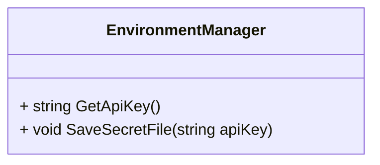

# Environments
(this class does not read env variable, but loads secrets from secret file.)

```mermaid
classDiagram
    class EnvironmentManager {
        + string GetApiKey()
        + void SaveSecretFile(string apiKey)
    }
```