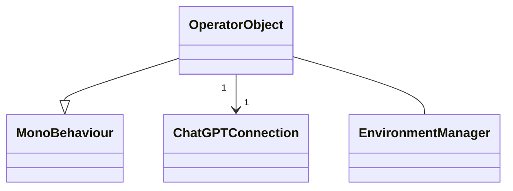

# operator

```mermaid
classDiagram
    class OperatorObject {
    }

    OperatorObject --|> MonoBehaviour
    OperatorObject "1" --> "1" ChatGPTConnection
    OperatorObject -- EnvironmentManager

```